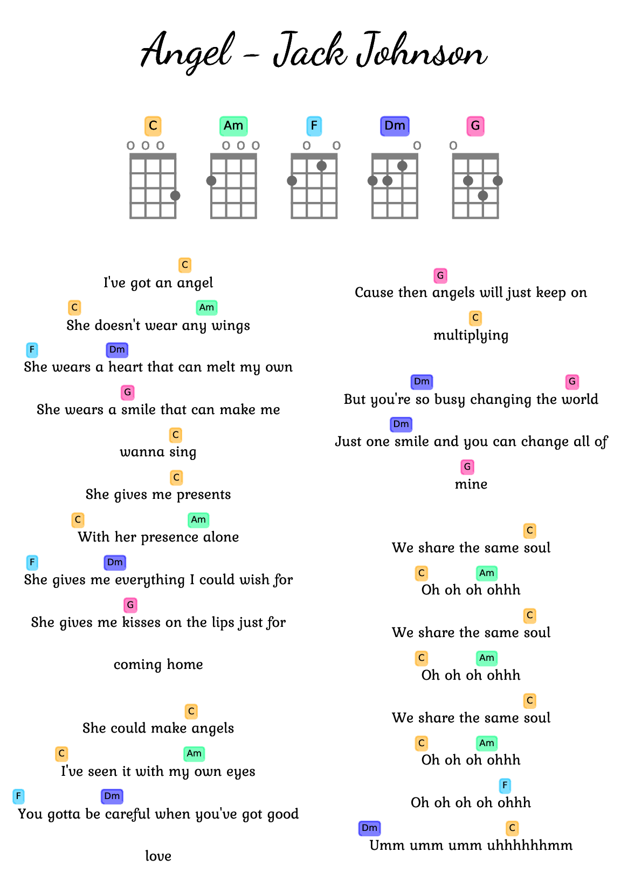

A simple command line python script to draw lyrics with Ukulele chords.

# Configuration
Create conda environment:  
`conda env create -f env_prereqs.yaml`

# Usage
Activate conda environement:  
`conda activate lyrichords_env`  
Use the script `lyrichords.py` to generated a PDF file:  
`python lyrichords.py ./examples/anglel.txt`  
_(You can type: `python lyrichords.py --help` to get more help on the commands)_  

# My to-do list  
- Add feature: choose between writting sharp or flat chords (eg: C# instead of Db, etc...)  
- Add feature: multiple column of lyrics on the same page  
- Take into account chords before the lyrics starts (For the moment, the minimum chord position is the first letter of the lyrics)  
- Add others uncommon chords (eg: http://all-guitar-chords.com/)  
- Add variant chords (different fingers position for a same chord)  
- Add fingers positions  
- Add chords that have to be muted, following the format from https://lessons.com/guitar-lessons/guitar-chords/how-to-read-guitar-chords  
- Find a way to use the chords database from this github page: https://github.com/tombatossals/chords-db  
- Review the ukulele chords database after considering all the points above  
- Take into account when the user just input chord lines without lyrics  
