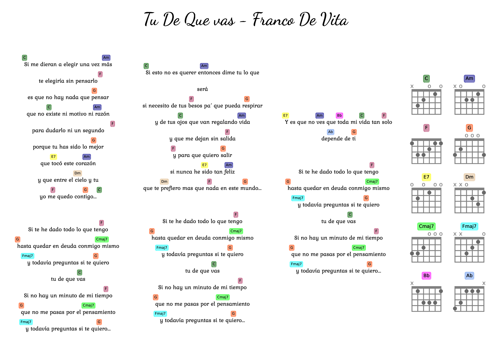
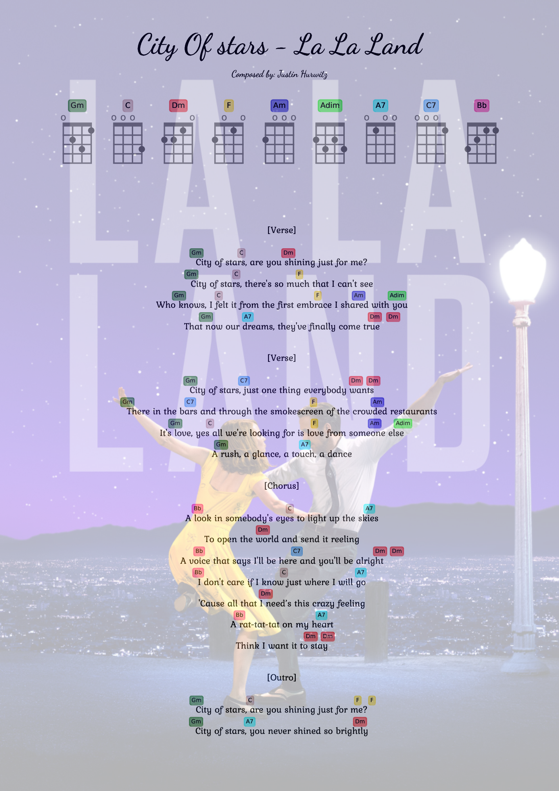
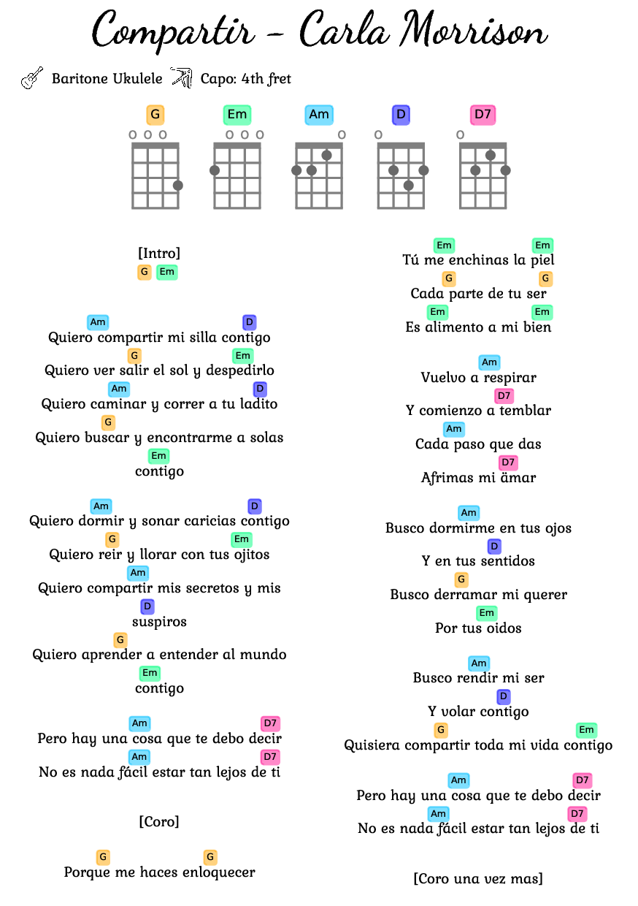

A simple command line python script to draw lyrics with Ukulele/Guitar chords.

# Configuration
Create conda environment:  
`conda env create -f environment.yaml`

# Usage
Activate conda environement:  
`conda activate lyrichords_env`  
Use the script `LyricsChords.py` to generated a PDF file:  
`python LyricsChords.py ./examples/anglel.txt`  
_(You can type: `python LyricsChords.py --help` to get more help on the commands)_  

# My to-do list  
- Add feature: choose between writting sharp or flat chords (eg: C# instead of Db, etc...)   
- Add others uncommon chords (eg: http://all-guitar-chords.com/)  
- Improve parsing chords robustness: Cmaj7 = C7M = CM7, etc...
- Add variant chords (different fingers position for a same chord)  
- Add fingers numbers  
- Song.isChordsLine: remove chracters that can be found in chords such as "," "-" "_"
- Add chords that have to be muted, following the format from https://lessons.com/guitar-lessons/guitar-chords/how-to-read-guitar-chords   
- Add rhythms

# Examples

Landscape orientation with guitar chords:  
`python LyricsChords.py ./examples/tu_de_que_vas.txt --page_format A4 --landscape --design_vertical --instrument GUITAR_EADGBE`  
  

Default instrument: Ukulele (GCEA tuning) + background + custom parameters:  
`python LyricsChords.py ./examples/city_of_stars.txt --page_format A4 --background ./examples/lalaland_background.jpg --lyrics_line_spacing 8 --title_height 35`  
  

Smaller page format:  
`python LyricsChords.py ./examples/compartir.txt --instrument UKULELE_DGBE --page_format A5 --lyrics_line_spacing 7.5 --title_height 11 --lyrics_fontsize 9 --chords_fret_spacing 3`  

