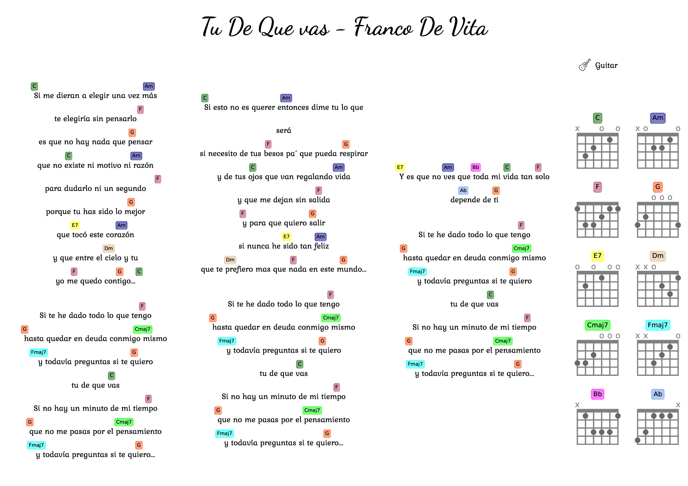
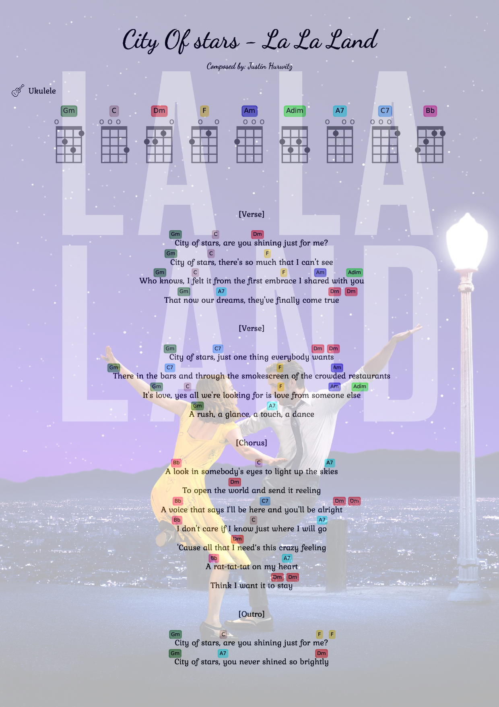

A simple command line python script to draw lyrics with Ukulele/Guitar chords.

# Configuration
Create conda environment:  
`conda env create -f env_prereqs.yaml`

# Usage
Activate conda environement:  
`conda activate lyrichords_env`  
Use the script `LyricsChords.py` to generated a PDF file:  
`python LyricsChords.py ./examples/anglel.txt`  
_(You can type: `python LyricsChords.py --help` to get more help on the commands)_  

# My to-do list  
- Add feature: choose between writting sharp or flat chords (eg: C# instead of Db, etc...)   
- Take into account chords written before the lyrics starts (For the moment, the minimum chord position is the first letter of the lyrics)  
- Add others uncommon chords (eg: http://all-guitar-chords.com/)  
- Add variant chords (different fingers position for a same chord)  
- Add fingers numbers  
- Add chords that have to be muted, following the format from https://lessons.com/guitar-lessons/guitar-chords/how-to-read-guitar-chords   
- Take into account when the user just input chord lines without lyrics  
- Add rhythms
- Add Instrument name

# Examples

Landscape orientation with guitar chords:  
`python LyricsChords.py ./examples/tu_de_que_vas.txt --page_format A4 --landscape --design_vertical --instrument GUITAR_EADGBE`  
  

Default instrument: Ukulele (GCEA tuning) + background + custom parameters:  
`python LyricsChords.py ./examples/city_of_stars.txt --page_format A4 --background ./examples/lalaland_background.jpg --lyrics_line_spacing 8 --title_height 35`  
  

Samller page format:  
`python LyricsChords.py ./examples/angel.txt --page_format A5`  

